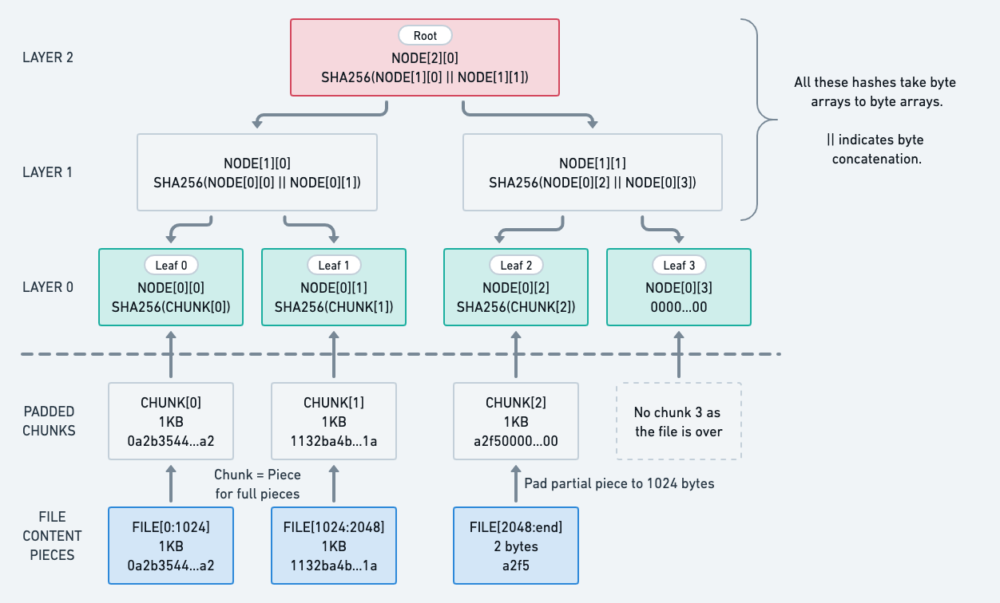
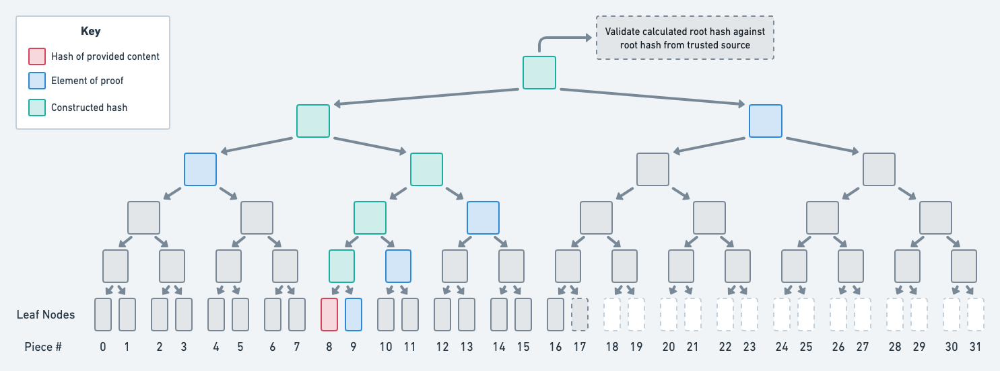

# Merkle Challenge - Merkle File Server

In this challenge, you will be testing a supplied Java web server that implements a specification of a simple trustless file server. The specification is provided below.

## Your task

Your task is in two parts:

1. Create a test plan: Review the goals/specification below and write a test plan for the server. Write down as many acceptance criteria / test cases as you can. Write this test plan up in markdown in your README.

2. Write some test/s: We'd like you to turn at least one or two of your test cases into automated tests. You don't need to write up all your test cases as automated tests. Include instructions on how to run these in your README.

### Pointers

* You may use any language/framework you feel comfortable with to write the automated tests. Feel free to choose Java, Kotlin, C#, Rust, Python or another language of your choice.
* You may use [Cucumber/Gherkin](https://cucumber.io/docs/gherkin/reference/) if you wish, but it's not requirement. If you do, ensure that the code is written for the steps behind the scenes, so that the tests can actually run.
* If, whilst exploring, you notice any issues or oddities with the specification or implementation, make a note of these in a README along with your solution.

# Product Goals / Context

_The following is written as a hypothetical brief for the file server product_

* We need to enable users to download large files in a decentralized manner
* We have created a proof of concept server, that we'd like to be tested before considering how to productionise it
* The proof of concept is intended to show that a file can be served to a user in a manner which is fault-tolerant and tamper-safe
* The user should be able to reconstruct the file, and verify the integrity of the file chunk-by-chunk against a small digest they have received from a trusted source

# Product Specification

The provided code is a trustless file server, similar to the BitTorrent peer-to-peer software.

In this scheme, a client who wishes to download a file would go to a trusted source to find the root merkle hash and file size. Using these values, the client can then request file pieces from an untrusted source (or sources), and validate that the received file pieces are correct.

Our server exposes the `hashes` HTTP endpoint to serve as something to represent this trusted source.

The `piece` HTTP endpoint can be used to download each piece of the file, along with a *proof* for the piece which they can use to reconstruct the root hash and verify that the provided piece is correct. By doing this for all the pieces, they can reconstruct the whole file.

## Merkle trees

A merkle tree is a hash-based tree data structure used in distributed systems for efficient data verification. They are used in peer-to-peer networks like Tor, Bitcoin, Git, and BitTorrent.

You can find more detailed interview information here: [https://brilliant.org/wiki/merkle-tree/](https://brilliant.org/wiki/merkle-tree/).

## Our file merkle tree specification

The algorithm we will use to calculate the merkle hash will follow closely the BitTorrent method of calculating a file's hash as seen in [Simple Merkle Hashes here](http://www.bittorrent.org/beps/bep_0030.html), except we will use the SHA-256 algorithm rather than SHA1, and we will have a hardcoded piece size of 1KB.

In particular:

* The merkle tree will be a perfectly balanced binary tree.
  * For leaf node hashes corresponding to complete file pieces, we take `Node Hash = SHA256(the 1024 file piece bytes)`.
  * For leaf node hashes corresponding to incomplete file pieces, we pad the chunk with 0s to a length of 1024 bytes before taking the SHA256 hash, ie `Node Hash = SHA256(the 1024 padded file piece bytes)`.
  * For leaf node hashes corresponding to non-existent file pieces (eg off the end of the file), we use a filler hash value of 32 zero bytes, ie `Node Hash = 0000...00`.
* Hash values for nodes in the higher levels of the tree are calculated by concatenating the child hash bytes of the left child with the child hash bytes of the right child, left to right, and computing the hash of that 64-byte aggregate.

To get a feel for the SHA256 hash, you can [play around with this calculator](https://emn178.github.io/online-tools/sha256.html) - but be sure to select "Input Type: **Hex**", and remember that a byte is represented by two hexadecimal characters.

The following diagram captures the tree for an example file of 2050 bytes:



## Server specification

The software is a simple java web server. You will require Java 11 or higher installed to run the server. It may run with earlier versions of Java, but this hasn't been tested (and needn't be tested).

The server must be started with one or more arguments — the path/s to the local files to be served through the web server.

The following will start the server with the provided `icons_rgb_circle.png` file:

```
java -jar merkle-tree-java.jar icons_rgb_circle.png
```

_NOTE: The file may have been named merkle-tree-java.jaz to circumvent email scanners - be sure to rename it to merkle-tree-java.jar_

The server will expose two HTTP endpoints:

1. `GET http://localhost:8080/hashes`
2. `GET http://localhost:8080/piece/:hashId/:pieceIndex`

The first `hashes` endpoint acts to list the files available on the server, and to mimic a source of trusted root hashes and file piece count.

The `piece` endpoint can then be used to request each piece of the given file, along with its merkle proof. Each piece (except possibly the final, incomplete piece) should be 1KB long. The content is returned base64 encoded. A client can use this merkle proof to verify that the `piece` is the correct piece for that index. Such a verification is detailed in the example below.

A client who wants to download a file now needs to obtain the root merkle hash from a trusted source along with the number of pieces. With this information, a client can use these two HTTP endpoints to download each piece and verify / reconstruct the whole file.

# Worked Example

The examples above are based on the file `icons_rgb_circle.png` provided with the specification.

## Run server

In a first terminal, run:

```
java -jar merkle-tree-java.jar icons_rgb_circle.png
```

## Get root hashes of each file

The endpoint `GET /hashes` should return a json list of the merkle hashes and number of 1KB pieces of the files this server is serving.

Example, when serving the single file `icons_rgb_circle.png`:

```
curl -i -H "Accept: application/json" -H "Content-Type: application/json" -X GET http://localhost:8080/hashes
```
```
[{
  "hash": "a287d3f91adfc2b0437f9eaf3922a27a0dcdec2d880b62fd65653a9669022e76",
  "pieces": 10
}]
```

## Get file pieces

The endpoint `GET /piece/:hashId/:pieceIndex` should return a verifiable piece of the content.

Parameter   | Description
----------- | -------------
:hashId     | the merkle hash of the file we want to download (in our case there will only be one)
:pieceIndex | the index of the piece we want to download (from zero to 'filesize divided by 1KB')

The returned object will contain two fields:

Field   | Description
------- | -------------
content | The binary content of the piece encoded in base64.
proof   | A list of hashes hex encoded to prove that the piece is legitimate. The first hash will be the hash of the sibling and the next will be the uncle's hash, the next the uncle of the uncle's hash and so on. With this information the client will be able to recalculate the root hash of the tree and compare it to the known root hash. (Please see *Simple Merkle Hashes* in <http://www.bittorrent.org/beps/bep_0030.html> for more thorough discussion, or the below diagram)

Example:
```
curl -i -H "Accept: application/json" -H "Content-Type: application/json" -X GET http://localhost:8080/piece/a287d3f91adfc2b0437f9eaf3922a27a0dcdec2d880b62fd65653a9669022e76/8
```
```
{
  "content": "19hnHRKcSHPmvCBLdT+4vQIA69Z+Jvb7wuUJU8bZecGNqBXgD6JuMdlFyElcfE36+BP7bg8tCjxCAYBjx49R8xZdxLygOFmir0etAA6iTlG3iOtp3bIbnTjh/u5koQD5+fmH5P/dHuPHTSOk1y4fmlSsdCtG1ArgSF+COkXPj3Q2ngKW/YMYAfbL/3sE1q/fJBoN4RPwUJR0NPBmBUDdIW086rJKaiPauNGzTtpk2d8HBfC849SvXKF7RzzEDRcj8uSIE2QMGrgo9EYFgG8fdYa6Qx2OHPkIV+n1FwvdESz738AE2iL/73HYtHEzZdRpJXL9YyW4OIdCeJsCoI5QV9iPkZHeijZ9vlle1fPACrAZI8Ba+X+PxdPP/E3sG8ZQjsUuZ+LkvUUBUCeOjA2xIg387GcXyKt5Llj210ABXJfg3kKcPXuW7mOzKCQ4QQRsYYW3KPMDT1cA1AHqAnWCuhnF5k4215U3gGV/CUyg5/iN5xl4heDo4Szqe8dw0dMhpTgmytcTFE9VAPwNE1x4zcC+vYfTwUPec2QsZJ45GyPAGKZnnAbnBPbvP0B3DhxBZcriYLxYsXEbK5zXxha5owJkZmbxPZcV9371s+DZ8IwIYcBOOxyaN2TIKDp40O2XgpyGlPn7oQDdmOcdH3sffj5+gsaOfVwcyVrKN0pkLMZmmgLzCALj41PGVuk8boTjx3/mey5HSCOPZ8Cz4Jngyy/lE0mxFavTww/91SMWs4oLlvmc3NzcrlCAOkz3aV2FeHXREmrcuAPhKFF4jnAIN5I5QQF+caONNLmX8sRJOgj5RpwUVm8RQt6kSSd6a/FS+S3vBst8Fr+k+/A/kfyfreJTDYGDBzPp0XFTqG6dlmJ/8YMPPCH/4j5AkFpMVFUxCkwY/yTb95nyLxrA5cuX4f6PhAIE8kR4ofhUQ8NLwJ0+NooH+gB5eXnD+AP32MemoVFCsKxjw/IQIfwAf1CbedTxZw0NzwbL+uGcnJxaUvyFAgSzGfS+/LuGhseCZf13lvX3+G2wFH8fzAN8+XOYQfbPZaGhUQKwjF9gDua3vlL8HeAPk5nfOr6moeGZYBn/hllZiv0f4L/58x8mM71uVVjDOwDZZk7kt35S7P8M/mMN5h7H1zU0PAss298xq0lx/1/wdzAKPMLUcwENjwLLNGz/B/mtvxR3Y/CXKvIseT2/2jetr4aGE4AsM9bw21gp5oWDvwSPUHumXhfQ8AiwLB/Ozc1ty2//7PkpDPzFAP7RaKZ37IzQ8FiwNXM2Ly9vFL8NkOJdNLDwhzJnM117nLeGRjHBsnue+Qy/LSfF2jnwDxEpOl8rgYa7ATLLnMdvI6Q4Fw98ASjBs0xtDmm4BQ==",
  "proof": [
    "c3b86d2641ec49e50d8bc53d88c2bfeb40557f4398262da7c51ea386005ae22f", // sibling's hash
    "f5a5fd42d16a20302798ef6ed309979b43003d2320d9f0e8ea9831a92759fb4b", // uncle's hash
    "db56114e00fdd4c1f85c892bf35ac9a89289aaecb1ebd0a96cde606a748b5d71", // uncle's uncle hash
    "08a8ee0b8150b89d9a55789b6c9851b516f8f8334df0562e5c94b9f087d69820" // child of root
  ]
}
```
**Diagram example of a 17 KB image**




